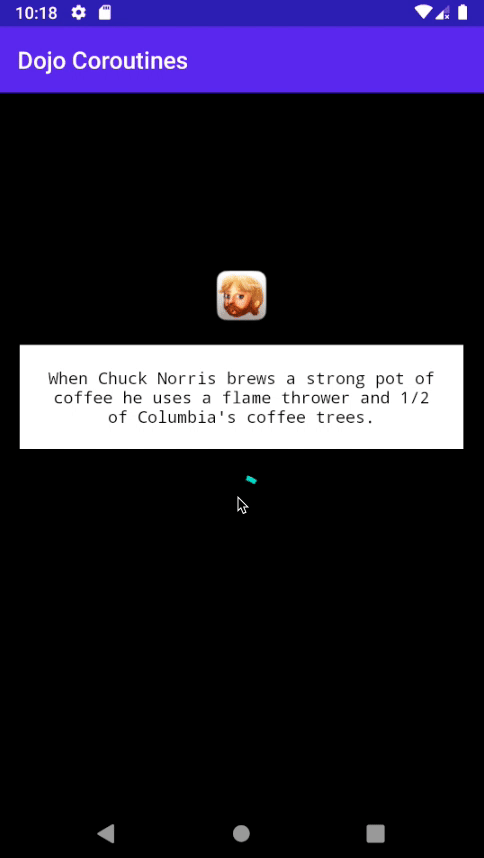

# Dojo Coroutines - I

### Desafio
O desafio do dojo é utilizar coroutines para acessar de forma assíncrona a [Chuck Norris Joke Api](https://api.chucknorris.io/)
e exibir uma `joke` na tela, assim como a imagem relacionada a ela.

### Obrigatório
- Respeitar o ciclo de vida do android
- Escrever testes

***Não é permitido o uso de extensions prontas de artefatos do `androidx`***

### Resultado esperado

